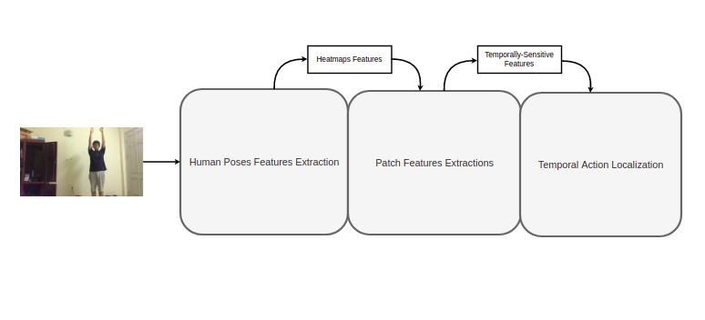

# Action_Localization_For_Rehabilitation


## Introduction
The problems of rehabilitation are always necessary while the human resources and economic conditions, the current labors machines are still limited, and some of the problems can be partly solved by automatically supporting motion recognition and supervision in rehabilitation for patients. There are methods for recognizing different behaviors and movements, but they are not many and difficult to apply to the current problem, especially similar specific methods in healthcare are almost non-existent, not to mention data related to this problem is very rare. almost all of them are confidential and are really lacking (it can be said that they don't exist). Therefore, in this study, I propose a 3-stages model: **Human Heatmaps Extractor**, **Patch Features Extractor**, and **Temporal Action Localizor**, using reasonable data augmentation methods, the model can learn generally from only limited datasets.

Our idea adapt from 3 model according to 3 stages:
* [Deep High-Resolution Representation Learning for Human Pose Estimation](https://github.com/leoxiaobin/deep-high-resolution-net.pytorch)
* [Temporally-Sensitive Pretraining of Video Encoders](https://github.com/HumamAlwassel/TSP)
* [ActionFormer: Localizing Moments of Actions with Transformers](https://github.com/happyharrycn/actionformer_release)

<br>

<div align="center">
    <br>
Model overview

</div>

<br>

## Quick start
1. Clone this repo, I'll call the directory that you cloned as ${REHAB_ROOT}
  ```
  git clone https://github.com/manhdqhe153129/Action_Localization_For_Rehabilitation.git
  ```
  
2. Set up NMS algorithm is implemented in C++ for Temporal Action Localizor stage
  ```
  cd ./ActionFormer/libs/utils
  python setup.py install --user
  cd ../../..
  ```
  The code should be recompiled every time you update PyTorch
  
3. Install dependencies
  ```
  pip install -r requirements.txt
  ```
 
4. Set up pretrained model (optional)

* Heatmaps Extractor:
    - Put pretrained to ```${REHAB_ROOT}/HRNET/ckpts/```
    - Example: ```${REHAB_ROOT}/HRNET/ckpts/pose_hrnet_w32_256x192.pth```

* Patch Features Extractor:
    - Put pretrained to ```${REHAB_ROOT}/TSP/ckpts/```
    - Example: ```${REHAB_ROOT}/TSP/ckpts/r2plus1d_12-tsp_on_rehab.pth```

* Temporal Action Localizer:
    - Put pretrained to ```${REHAB_ROOT}/ActionFormer/ckpts/```
    - Example: ```${REHAB_ROOT}/ActionFormer/ckpts/rehab_r2plus1d_12_expansion.pth.tar```
  
## Main results on rehabilitation custom data
| Arch                                                        | mAP@tIoU0.5 | mAP@tIoU0.6 | mAP@tIoU0.7 | mAP@tIoU0.8 | mAP@tIoU0.9 | mAP@tIoU.3-.9 |
|-------------------------------------------------------------|-------------|-------------|-------------|-------------|-------------|---------------|
| HR-R(2+1)D18-ActionFormer                                   | 0.998       |     0.985   |  0.965      |  0.846      | 0.35        | 0.877         |
| HR-R(2+1)D12-ActionFormer                                   | 0.999       |     0.978   |  0.883      |  0.737      | 0.260       | 0.837         |
| **HR-R(2+1)D12-ActionFormer**<br><sup>(expansion ratio 1.5) | 0.999       |     0.995   |  0.917      |  0.758      | 0.499       | 0.881         |
| LiteHR-R(2+1)D12-ActionFormer<br><sup>(expansion ratio 1.5) | -           |     -       |  -          |  -          | -           | -             |
 
Model checkpoints

| Arch                                                        | Heatmaps Extractor     | Patch Features Extractor | Temporal Action Localizor |
|-------------------------------------------------------------|------------------------|--------------------------|---------------------------|
| HR-R(2+1)D18-ActionFormer                                   | OneDrive / [GoogleDrive](https://drive.google.com/file/d/1WLCTxrD71DKJcCwqmUjhw9F8RJ4bdsMS/view?usp=sharing) | OneDrive / [GoogleDrive](https://drive.google.com/file/d/1qNvusigmY_czR5osHJx-Yf4ZW45CS96M/view?usp=sharing)   | OneDrive / [GoogleDrive](https://drive.google.com/file/d/1SoPvzKJ-x3xvwq6XVWw75fcrECeEo1Fl/view?usp=sharing)    |
| HR-R(2+1)D12-ActionFormer                                   | OneDrive / [GoogleDrive](https://drive.google.com/file/d/1WLCTxrD71DKJcCwqmUjhw9F8RJ4bdsMS/view?usp=sharing) | OneDrive / [GoogleDrive](https://drive.google.com/file/d/1oMQ9U8JRoXI6U9ZFb6CGKDbajmr7Grak/view?usp=sharing)   | OneDrive / [GoogleDrive](https://drive.google.com/file/d/1BD2ePwcvME9Q6oOvDH5RNkSZ5e7SqE_z/view?usp=sharing)    |
| **HR-R(2+1)D12-ActionFormer**<br><sup>(expansion ratio 1.5) | OneDrive / [GoogleDrive](https://drive.google.com/file/d/1WLCTxrD71DKJcCwqmUjhw9F8RJ4bdsMS/view?usp=sharing) | OneDrive / [GoogleDrive](https://drive.google.com/file/d/1oMQ9U8JRoXI6U9ZFb6CGKDbajmr7Grak/view?usp=sharing)   | OneDrive / [GoogleDrive](https://drive.google.com/file/d/1f_11V323pB8ypj12F32NB87NXdXlFJF7/view?usp=sharing)    |
| LiteHR-R(2+1)D12-ActionFormer<br><sup>(expansion ratio 1.5) | -                      | -                        | -                         |
  
## Run demo
  ```
  python tools/demo.py --HRNet-ckpt {HRNet_ckpt} --TSP-ckpt {TSP_ckpt} \
                    --ActionFormer-ckpt {ActionFormer_ckpt} --video {video_path}
  ```
  Where:
  + **HRNet_ckpt**: Heatmaps Extractor checkpoint path
  + **TSP_ckpt**: Patch Features Extractor checkpoint path
  + **ActionFormer_ckpt**: Temporal Action Localizer checkpoint path
  + **video path**: video for demo path
    
  Example:
  ```
  python tools/demo.py --HRNet-ckpt HRNet/ckpts/pose_hrnet_w32_256x192.pth --TSP-ckpt TSP/ckpts/r2plus1d_12-tsp_on_rehab.pth \
                    --ActionFormer-ckpt ActionFormer/ckpts/rehab_r2plus1d_12_expansion.pth.tar --video videos_demo/1654213852135.mp4
  ```

<br>

<div align="center">
    <br>
Output demo

</div>

<br>
